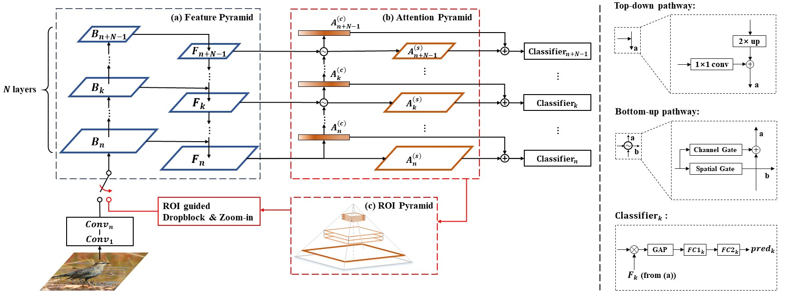

# AP-CNN

This repository contains the pytorch implementation for the CVPR#6637 paper "Weakly Supervised Attention Pyramid Convolutional Neural Network for Fine-Grained Visual Classification".


### Dependencies
Python 3.6 with all of the `pip install -r requirements.txt` packages including:
- `torch == 0.4.1`
- `opencv-python`
- `visdom`

### Data
1. Download the FGVC image data. Extract them to `data/cars/`, `data/birds/` and `data/airs/`, respectively.
* [Stanford-Cars](https://ai.stanford.edu/~jkrause/cars/car_dataset.html) (cars)
```python
  -/cars/
     └─── car_ims
             └─── 00001.jpg
             └─── 00002.jpg
             └─── ...
     └─── cars_annos.mat
```
* [CUB-200-2011](http://www.vision.caltech.edu/visipedia/CUB-200-2011.html) (birds)
```python
  -/birds/
     └─── images.txt
     └─── image_class_labels.txt
     └─── train_test_split.txt
     └─── images
             └─── 001.Black_footed_Albatross
                       └─── Black_Footed_Albatross_0001_796111.jpg
                       └─── ...
             └─── 002.Laysan_Albatross
             └─── ...
```
* [FGVC-Aircraft](http://www.robots.ox.ac.uk/~vgg/data/fgvc-aircraft/) (airs)
```python
   -/airs/
     └─── images
             └─── 0034309.jpg
             └─── 0034958.jpg
             └─── ...
     └─── variants.txt
     └─── images_variant_trainval.txt
     └─── images_variant_test.txt
```

2. Preprocess images.
  - For birds: `python utils/split_dataset/birds_dataset.py`
  - For cars: `python utils/split_dataset/cars_dataset.py`
  - For airs: `python utils/split_dataset/airs_dataset.py`

### Training
**Start:**

1. `bash lib/make.sh` to compile NMS.

2. `python train.py --dataset {cars,airs,birds} --model {resnet50,vgg19} [options: --visualize]` to start training.
- For example, to train ResNet50 on Stanford-Cars: `python train.py --dataset cars --model resnet50`
- Run `python train.py --help` to see full input arguments.

**Visualize:** 
1. `python -m visdom.server` to start visdom server.

2. Visualize online attention masks and ROIs on `http://localhost:8097`.

### Pretrained Model
Download from: https://pretrained_models_ap_cnn


